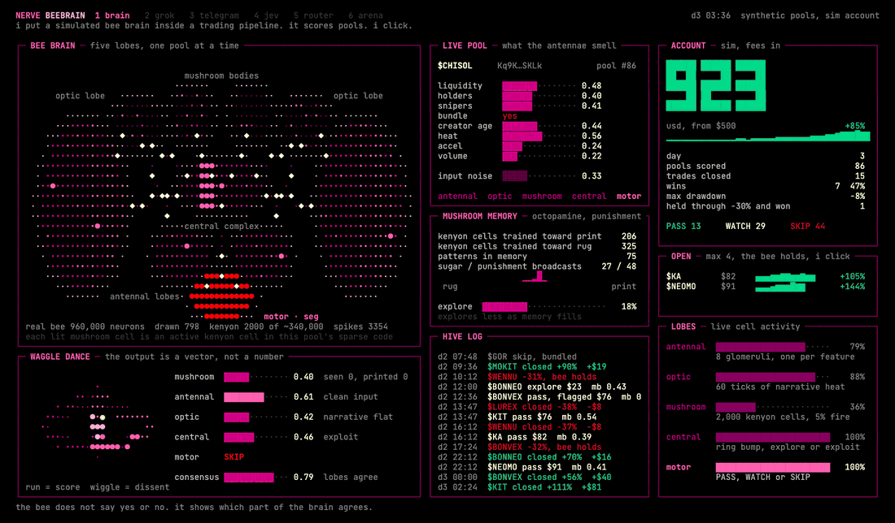
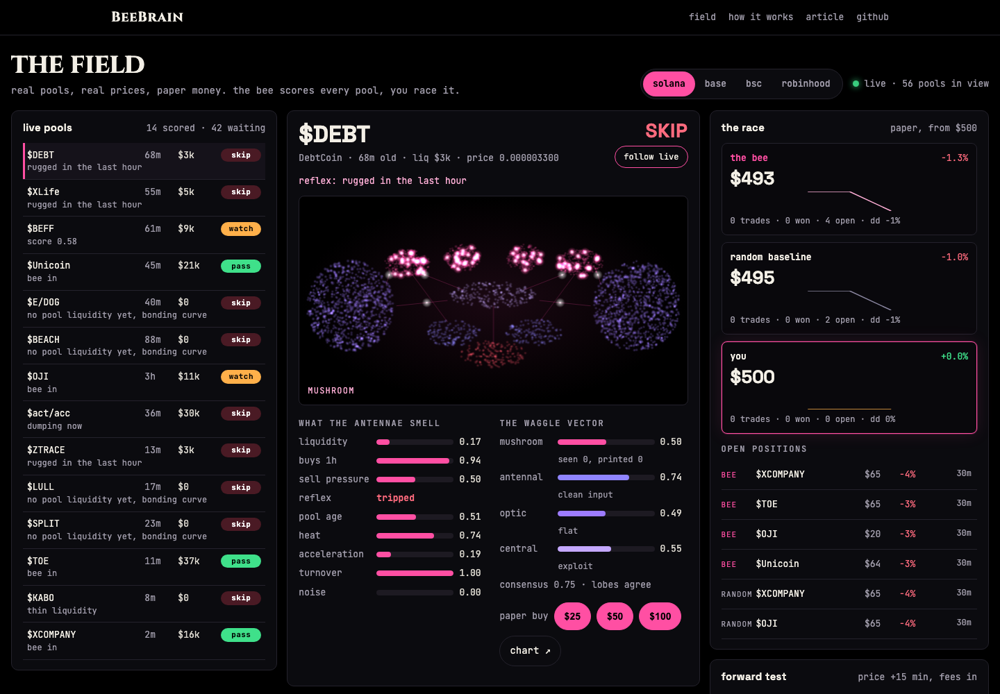
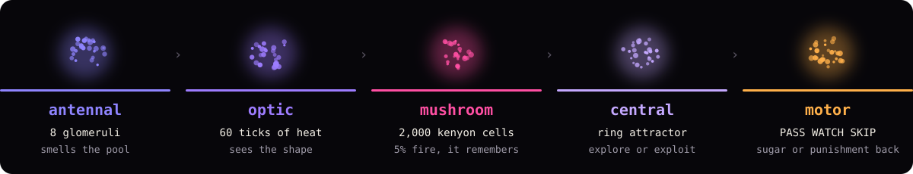
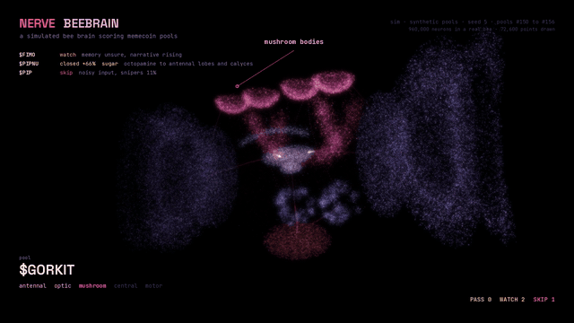
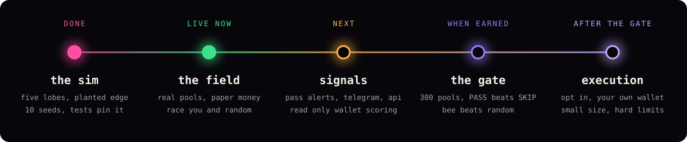

<p align="center">
  
</p>

<p align="center">a honeybee brain, simulated, scoring memecoin pools inside nerve.</p>

<p align="center">
  
  <a href="LICENSE"></a>
  <a href="https://github.com/h100envy/beebrain/actions/workflows/ci.yml"></a>
  <a href="https://x.com/beebrainnerve"></a>
  <a href="https://beebrain.pro/trade/"></a>
</p>

<p align="center">
  <a href="https://beebrain.pro/trade/"><b>race the bee live</b></a> ·
  <a href="#how-it-works"><b>how it works</b></a> ·
  <a href="#results-so-far"><b>results</b></a> ·
  <a href="docs/article.md"><b>the article</b></a> ·
  <a href="https://x.com/beebrainnerve"><b>x.com/beebrainnerve</b></a>
</p>

<p align="center">
  
</p>

## what it is

a simulated honeybee brain: 2,000 kenyon cells, a 5% sparse code.
it scores every new pool through five lobes, after the reflexes and before the models.
it answers with a vector, one value per lobe, not one number.
it learns from closed trades. a print is sugar, a rug is punishment.

the sim runs on synthetic pools. the field runs the same brain on real pools. both trade paper money. this release places no orders.

## race the bee on real pools



the field drops the bee on live memecoin pools from solana, base, bsc and robinhood chain. it scores every pool through five lobes. three paper accounts race from $500: you, the bee on autopilot, and a random baseline behind the same reflexes.

every PASS lands in a signals list with a copy CA button and, if you want, a browser notification. every scored pool is checked again 15 minutes later, fees in, so each verdict gets a real hit rate. when PASS beats SKIP over 300 pools and the bee beats random, the graduation gate opens. until then it is paper only.

```
beebrain trade --chain solana      # the field in the terminal. b buy, s sell, q quit
beebrain scan --chain base --json  # one pass over the live field, for your own tools
beebrain forage --chain solana --minutes 60 --out solana.json && beebrain report solana.json
```

or open [beebrain.pro/trade](https://beebrain.pro/trade/): nothing to install, the bee keeps learning in your browser. data is read only, from the public dexscreener and geckoterminal apis. how it works: [docs/field.md](docs/field.md).

## quick start

```
pip install beebrain        # or: pip install -e .
beebrain terminal
beebrain sim --seeds 0-9
```

| command | what it does |
| --- | --- |
| `beebrain terminal` | the live terminal. `--layout wide`, `--speed 3`, `--seed 7`, `--post 2` for the grok stage, `--post 3` for telegram |
| `beebrain terminal --trades examples/trades_example.csv --start 500` | plays your own closed trades as a LIVE ACCOUNT next to the brain |
| `beebrain terminal --plain --frames 50` | no animation, prints one frame and exits |
| `beebrain sim --days 9 --seeds 0-9 --json` | headless runs: final account, trades, wins, win rate, max drawdown |
| `beebrain sim --seeds 5 --vector 120` | the waggle vector of one pool as json |
| `beebrain trade --chain solana` | the field: live pools, three paper accounts, the forward test |
| `beebrain scan --chain solana --json` | score the live field once and print every pool |
| `beebrain forage --minutes 60 --out f.json` then `beebrain report f.json` | a headless field run and a markdown report: forward test, reflexes, the race, which senses moved with the outcome |
| `beebrain render video\|stills\|figures` | the 3d video, point cloud stills and article figures. needs `pip install -e '.[render,figures]'` |

the package and the terminal are stdlib only, python 3.9 and newer.

## how it works

<p align="center">
  
</p>

<p align="center">
  
</p>

| lobe | in a real bee | in beebrain |
| --- | --- | --- |
| antennal | first relay for smell, glomeruli | eight glomeruli, one per pool feature: liquidity, holders, snipers, bundle, creator age, heat, acceleration, volume. measures input noise |
| optic | vision, motion, shape | reads 60 ticks of narrative heat. sees the shape of the market, not single numbers |
| mushroom | association and memory | 2,000 kenyon cells, each samples 6 of 32 binned inputs. only the top 5% fire for any pool |
| central | navigation and action selection | a ring attractor bump settles on the score. explore or exploit |
| motor | subesophageal ganglion, home of vummx1 | PASS, WATCH or SKIP, and the reward broadcast back into memory |


when a trade closes, the result travels back on one of two channels. a print goes on the octopamine channel, the sugar signal a bee's vummx1 neuron carries. a loss goes on a separate punishment channel. only the kenyon cells that fired for that pool are updated. rug memory never fades faster than print memory.

every formula and threshold, with the constant name used in code: [docs/model.md](docs/model.md). the module map: [docs/architecture.md](docs/architecture.md).

## the waggle vector

a forager's dance carries direction, distance and quality. beebrain answers the same way. this is one pool from seed 5:

<!-- sim:vector -->
```json
{
  "pool": "$BONGOR",
  "mushroom": {
    "value": 0.2,
    "seen": 9,
    "printed": 1
  },
  "antennal": {
    "value": 0.65,
    "noise": 0.14
  },
  "optic": {
    "value": 0.51,
    "heat": 0.42,
    "accel": 0.61
  },
  "central": {
    "value": 0.41,
    "mode": "exploit"
  },
  "motor": {
    "verdict": "SKIP",
    "flag": false
  },
  "consensus": 0.6,
  "kenyon_active": 100
}
```
<!-- /sim:vector -->


in the terminal the length of the straight run is the score and the width of the wiggle is the dissent between lobes.

## results so far


**synthetic pools, the edge was planted, this proves the mechanism not the market.**

<!-- sim:seeds -->
| seed | final | trades | win rate | max drawdown |
| --- | --- | --- | --- | --- |
| 6 | $6,966 | 49 | 67% | -22% |
| 8 | $6,661 | 43 | 65% | -15% |
| 4 | $2,942 | 41 | 59% | -18% |
| 7 | $1,998 | 39 | 62% | -22% |
| 1 | $1,695 | 30 | 67% | -16% |
| 5 | $1,526 | 40 | 55% | -22% |
| 9 | $1,049 | 27 | 56% | -21% |
| 3 | $754 | 22 | 36% | -20% |
| 0 | $589 | 19 | 42% | -12% |
| 2 | $486 | 25 | 44% | -31% |
<!-- /sim:seeds -->

paper account from $500, nine days of 40 pools, fees in. `beebrain sim --seeds 0-9` prints this table. the tests pin it.

### first contact with the real market

three headless field runs, 26 september 2026, a fresh bee each time, 15 minute forward test, fees in:

| | solana, 74 min | base, 80 min | solana, 140 min |
| --- | --- | --- | --- |
| forward tested | 516 | 123 | 844 |
| PASS hit rate | 31% (36) | 17% (6) | 33% (18) |
| SKIP by the brain, hit rate | 13% (238) | 33% (21) | 23% (502) |
| the bee | -30.3% | +1.0% | -49.7% |
| random baseline | -69.8% | -16.7% | +28.8% |

**across all 1,483 pools the bee's passes went up 30% of the time and its own skips 20%. it beat random in two runs out of three, and lost the longest one. the gate stays closed.** full reports and raw data: [docs/field-reports](docs/field-reports/).

## what it does not do

- **it is scaled down.** a real bee has about 960,000 neurons. the model runs 2,000 kenyon cells and a few hundred drawn cells for display.
- **it is not a connectome.** there is no public whole brain honeybee wiring file to load. the lobes, the sparse code and the reward channel follow published biology, the numbers inside are mine.
- **its scores are not probabilities.** a mushroom value of 0.81 means the sparse code leans toward past prints. it is uncalibrated.
- **it can only learn edges that exist.** in both simulations the edge was planted. on a live chain the edge may be weaker, slower or gone.
- **it does not trade for you yet.** nerve returns a scored feed and this release places no orders. the field is paper money on real prices.

more in [docs/limitations.md](docs/limitations.md).

## roadmap

<p align="center">
  
</p>

- signals: pass alerts, a telegram bot and a json api, so you can act on the bee by hand.
- read only wallet scoring: paste a public address, see how the bee would have scored every trade you made.
- the hive: one bee per chain with a shared mushroom memory, and a bee that arrives trained instead of empty.
- the gate: 300 forward tested pools, PASS beats the brain's own SKIP, the bee beats random.
- execution after the gate: opt in, your own wallet signs, small size, hard limits. never custody.

the full plan: [docs/roadmap.md](docs/roadmap.md).

## the article and the site

the full write up is in [docs/article.md](docs/article.md). the static site in [web/](web/) has the landing page, the article and the robinhood chain node graph, ready for any static host.

## sources

- [honeybee brain: ~960,000 neurons in ~1 mm³ (bionumbers, citing menzel and giurfa 2001)](https://bionumbers.hms.harvard.edu/bionumber.aspx?id=109328)
- [the mushroom body: ~175,000 kenyon cells per mushroom body in the bee, ~2,500 in the fly (campbell and turner 2010)](https://repository.cshl.edu/id/eprint/15381/)
- [experience and age grow kenyon cell dendrites in foragers (farris et al. 2001)](https://pmc.ncbi.nlm.nih.gov/articles/PMC6763189)
- [vummx1, octopamine as reward and dopamine as punishment in insect learning (mizunami and matsumoto 2010)](https://www.frontiersin.org/journals/behavioral-neuroscience/articles/10.3389/fnbeh.2010.00172/pdf)
- [von frisch and the waggle dance (nature)](https://www.nature.com/articles/533032a)
- [waggle run duration and distance (nc state extension)](https://content.ces.ncsu.edu/honey-bee-dance-language)
- flywire adult fruit fly connectome, nature 2024: 139,255 neurons, about 54.5 million synapses

## built on nerve

beebrain is a node for [nerve](https://github.com/h100envy/nerve), a nervous system for trading agents. the idea comes from the nerve protocol.

## follow the bee

new builds, field reports and the bee's forward test land first on x: [@beebrainnerve](https://x.com/beebrainnerve).

## license

[MIT](LICENSE)
