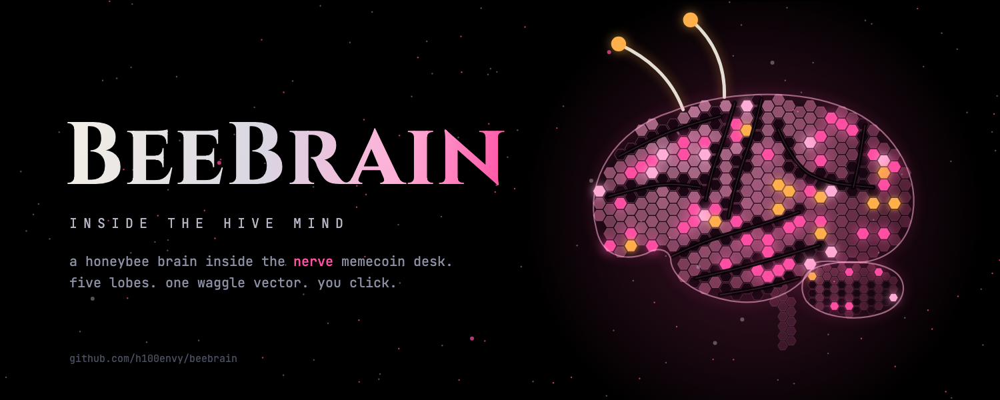
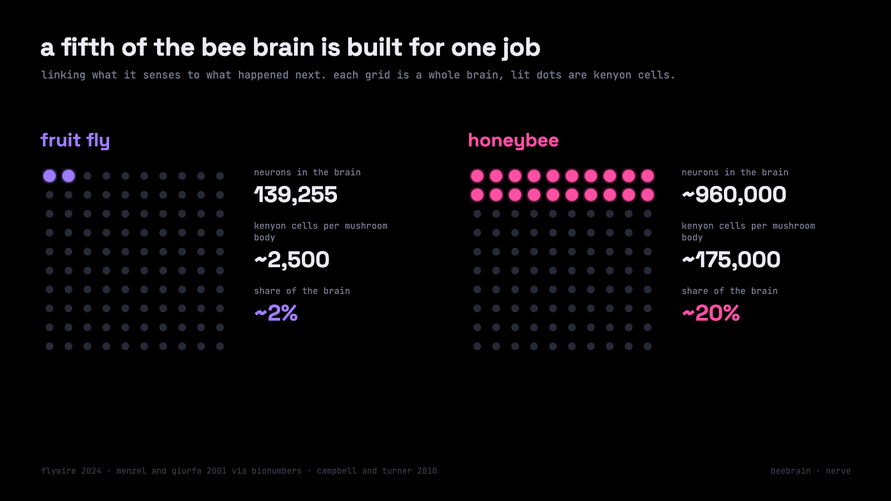
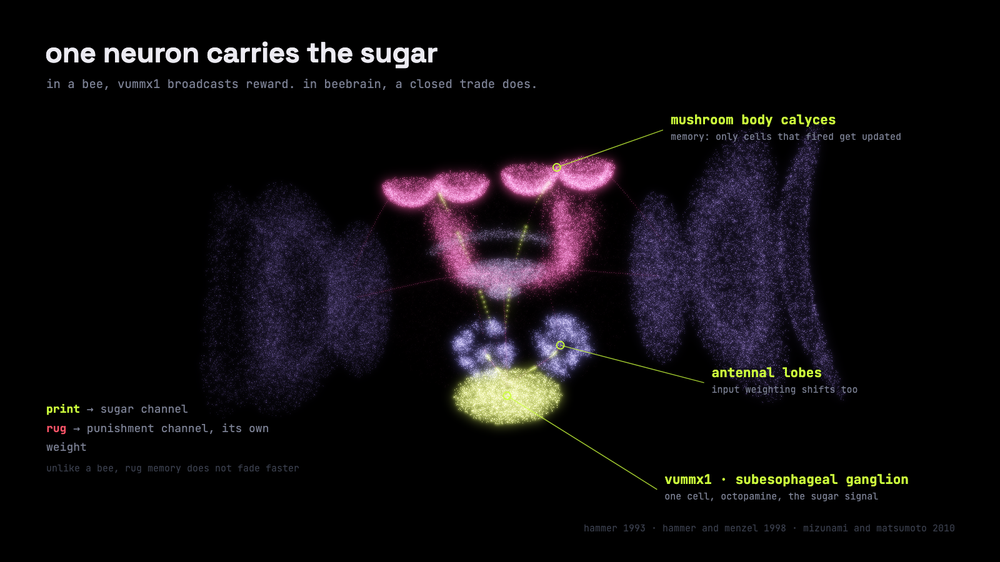
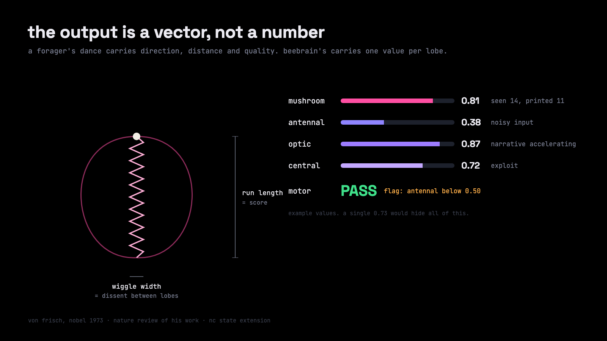
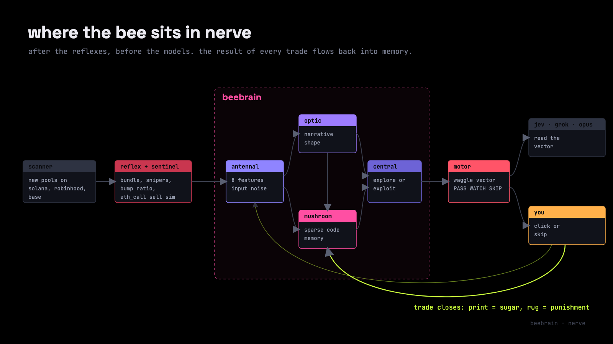
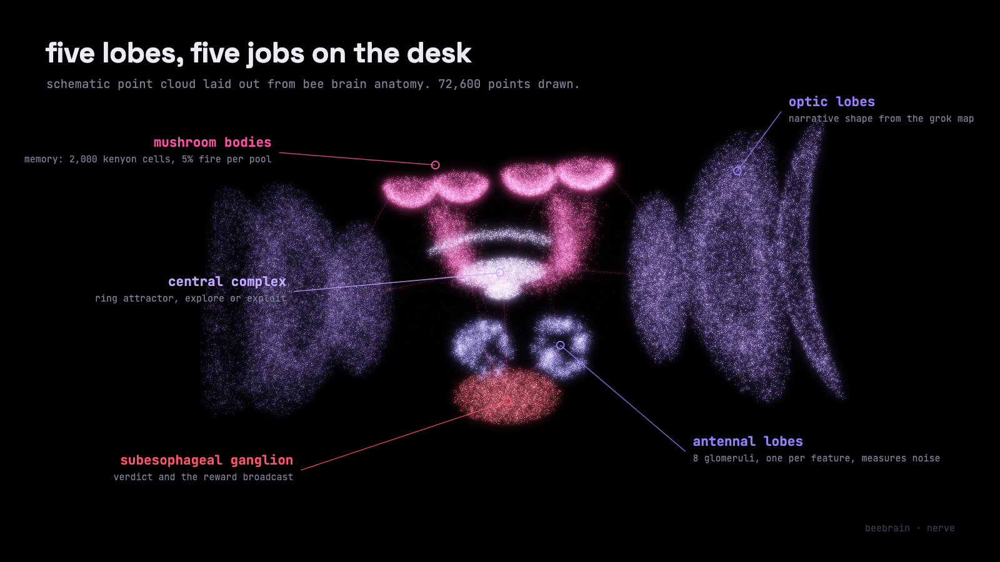
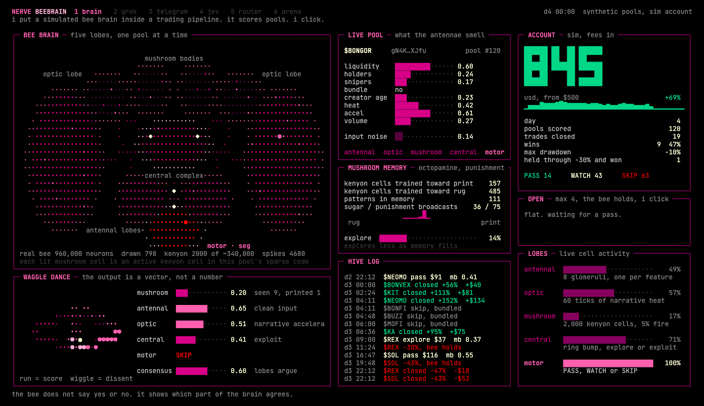
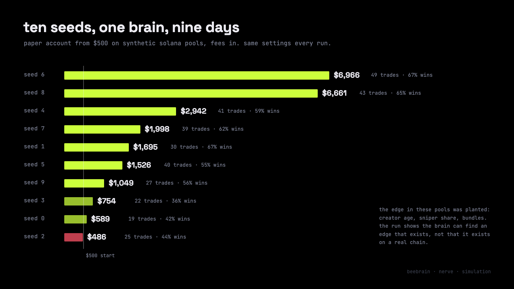
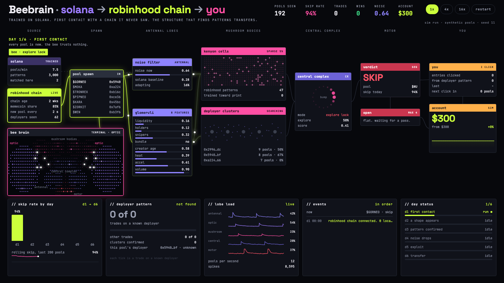

# BEEBRAIN · NERVE

**a bee brain inside a memecoin desk.**

nerve already had reflexes, a spine and a row of model nodes. it did not have a brain that learns from its own trades.

beebrain is that brain. a simulated honeybee mind that sits inside the nerve pipeline, scores every new pool through five lobes, and shows you which part of itself agrees and which part does not.

this is how it got there, what it is built from, and what it still cannot do.

## 1. after the fly, i looked at the bee

the first brain in nerve was a fruit fly. henry-01 ran 761 simulated neurons and 2,564 synapses across three regions: two optic lobes, a central brain and a nerve cord.

it learned which trading signal to trust by trial and error. exploration started at 60% and decayed to 6%. on its own it found that creator wallet age was the signal worth listening to.

the idea came from flywire. in 2024 that project published the full wiring of an adult fruit fly brain: 139,255 neurons and about 54.5 million synapses. for the first time a whole brain could be explored like a map.

but a fly has a small learning center. it has about 2,500 kenyon cells per mushroom body, the part of the insect brain that learns associations. a honeybee has roughly 175,000 per mushroom body.

that gap is the whole reason for this article. if the fly could find one signal, what would a brain built for learning find in a memecoin feed?

## 2. a million neurons in one cubic millimetre

the honeybee brain has a volume of about 1 mm³ and holds around 960,000 neurons ([bionumbers, after menzel and giurfa 2001](https://bionumbers.hms.harvard.edu/bionumber.aspx?id=109328)). that is roughly seven times the fly.

the number that matters for trading is not the total. it is where the neurons sit. kenyon cells make up about 20% of all neurons in a bee brain and about 2% in a fly ([campbell and turner 2010](https://repository.cshl.edu/id/eprint/15381/)).

so a bee spends a fifth of its brain on one job: linking what it senses to what happened next. that is the exact job of a memecoin scorer.

there is one more detail i keep coming back to. forager bees with more flying experience grow more branched dendrites in their mushroom bodies than bees of the same age that flew less ([farris et al. 2001](https://pmc.ncbi.nlm.nih.gov/articles/PMC6763189)). experience literally rewires the learning center.

a caveat worth stating early. i did not find a public whole-brain honeybee connectome like flywire. there are anatomical atlases and decades of physiology, but no complete synapse map. beebrain borrows the architecture, not a wiring file.

## 3. one neuron carries the sugar

in 1993 martin hammer found a single identified neuron in the bee brain that stands in for reward. it is called vummx1. when he paired an odor with electrical stimulation of that one cell, the bee learned the odor as if it had been fed sugar ([mizunami and matsumoto 2010, reviewing hammer 1993](https://www.frontiersin.org/journals/behavioral-neuroscience/articles/10.3389/fnbeh.2010.00172/pdf)).

vummx1 is octopaminergic. in 1998 hammer and menzel injected octopamine straight into the antennal lobes and the mushroom body calyces, the places this neuron ends. the injection replaced the sugar. the bee still learned.

the punishment channel runs on a different chemical. in insects dopamine carries the aversive signal, the opposite of the reward role it plays in mammals. the same review notes that punishment memories fade faster than reward memories in insects.

this is the most useful thing i took from bee biology. a memecoin desk has the same two channels:

- a closed trade in profit is sugar. it is broadcast to the antennal lobes and the mushroom bodies at once, like vummx1
- a rug is punishment. it travels on a separate channel with its own weight
- one design choice goes against the bee. in beebrain rug memory does not fade faster than print memory. a creator who rugged once is not forgiven because time passed

in the first terminal build i labelled the reward signal dopamine. that is the mammal convention and it is wrong for a bee. the next build calls it what it is.

## 4. the waggle dance is an output format

karl von frisch decoded it and shared the 1973 nobel prize for it. a forager returns to the hive and runs a figure eight on the comb. the straight waggling run carries the message ([nature, review of von frisch's work](https://www.nature.com/articles/533032a)).

- the angle of the run against vertical encodes direction relative to the sun
- the duration of the run encodes distance. a 2.5 second run points to food roughly 2.6 km away ([nc state extension](https://content.ces.ncsu.edu/honey-bee-dance-language))
- the vigour of the dance tracks how good the source is

the bee does not say food yes or food no. it sends a small structured vector that other bees can act on. during swarming, scout bees use the same dance to argue for different nest sites.

that is exactly what was missing in nerve. every node used to return one number. a confidence of 0.73 hides everything: five lobes at 0.73 and three lobes at 0.95 with two at 0.40 are completely different situations.

so beebrain answers with a waggle vector instead:

| field | what it carries |
| --- | --- |
| mushroom | memory: how often this pool shape was seen and how often it printed |
| antennal | input quality: how noisy and self contradicting the pool data is |
| optic | market shape: narrative heat and acceleration |
| central | the decision state: score, explore or exploit |
| motor | the verdict: PASS, WATCH or SKIP, plus a flag when one lobe dissents |
| consensus | how much the lobes agree |

in the terminal the dance is drawn literally. the length of the straight run is the score. the width of the wiggle is the dissent between lobes.

## 5. what nerve already had

nerve is a nervous system for trading agents. each agent is a specialised nerve, and reflexes fire before any model is called. beebrain plugs into it, so here is the body it lives in.

five pieces hold the protocol together:

| piece | job |
| --- | --- |
| impulse | the typed message every node sends and receives |
| nervenode | the agent contract, with a mandatory boundary on what each node may touch |
| reflex | deterministic checks that run before any model call |
| spine | the router that decides which node sees an impulse next |
| nervestore | the audit trail of every impulse and verdict |

and these are the nodes a memecoin pool meets today:

| node | what it does on a new pool |
| --- | --- |
| scanner | watches new dex pools on solana, robinhood chain and base |
| reflex layer | kills bundled launches, sniper heavy pools and bump ratio abuse without a model |
| sentinel | simulates a sell with eth_call to catch honeypots and hidden taxes |
| jev | answers four typed questions in about 190 ms: liquidity, team, narrative, timing |
| memecoin analyzer | checks who made the token: copied descriptions, twitter age, telegram ratio, whois age, creator wallet history |
| grok narrative brain | reads ct, telegram and reddit, builds a live narrative map with acceleration and freshness |
| opus 5.5 analyst | writes a thesis, attacks it, rewrites it. only the thesis that survives leaves the slot |
| risk and exit | sizing, stops and the exit manager |

nerve never holds your keys. the pool scanner returns a scored feed and you decide. five presets sit on top of the same nodes: paranoid, sprinter, grinder, sniper and ghost, the paper only benchmark that buys nothing.

what nerve lacked was memory that learns. every node judged each pool as if it were the first one it had ever seen.

## 6. where the bee sits in nerve

beebrain sits after the reflexes and before the models. the cheap deterministic checks still kill the obvious rugs first. the bee only sees pools that survived them.

each lobe maps to a job the desk already needed:

| lobe | in a real bee | in beebrain |
| --- | --- | --- |
| antennal lobes | first relay for smell, organised in glomeruli | eight glomeruli, one per pool feature: liquidity, holders, snipers, bundle, creator age, heat, acceleration, volume. measures input noise |
| optic lobes | vision, motion, shape | reads 60 ticks of narrative heat from the grok map. sees the shape of the market, not single numbers |
| mushroom bodies | association and memory | 2,000 simulated kenyon cells. each samples 6 of 32 binned inputs. only the top 5% fire for any pool |
| central complex | navigation and action selection | a ring attractor bump that settles on the score. decides explore or exploit |
| subesophageal ganglion | mouthparts and feeding, home of vummx1 | the verdict and the reward broadcast back into memory |

one pool through the brain looks like this:

1. the pool arrives as an impulse. each glomerulus lights up with its feature value
2. the optic lobes compare the pool's narrative against the heat history
3. the mushroom bodies form a sparse code. roughly 100 of 2,000 cells fire. their learned weights give the memory score
4. the central complex weighs memory, input quality, narrative and sniper share. early on it explores half the time. that falls to 5% as memory fills
5. the motor output emits PASS, WATCH or SKIP with the full waggle vector
6. when the trade closes, the result travels back as sugar or punishment. only the kenyon cells that fired for that pool are updated

that last step is the whole point. the bee does not learn a rule like creator age above x. it learns which combinations of features, coded sparsely, tend to end in sugar.

## 7. first run on solana: the terminal

the first beebrain build is a terminal. black background, pink hairlines, one screen:

- **bee brain.** about 800 drawn cells laid out as real lobes. four calyces on top, two big optic lobes, the central complex, antennal lobes and the motor node. white pulses run along the tracts as a pool moves through
- **waggle dance.** a live figure eight next to the per lobe vector
- **live pool.** the eight features the antennae smell, plus input noise
- **mushroom memory.** how many kenyon cells lean toward print or rug, and how fast exploration is falling
- **account, open positions, hive log.** every entry, every drawdown the bee held through, every close

the run used synthetic solana pools, a paper account starting at $500, fees included, and nine simulated days of 40 pools each. i ran ten seeds with the same settings.

the spread is the honest part. on three seeds the bee grew cautious early, traded little and went nowhere. on two it compounded hard.

and the important caveat. these pools are synthetic, and i planted the edge myself: creator age, sniper share and bundles decide the hidden odds. the run shows that the brain can find an edge that exists. it does not show that this edge exists on a real chain. that is what live data is for.

## 8. first contact with robinhood chain

the real test of a brain is a place it has never seen. so the second build drops the solana trained bee onto robinhood chain, where memecoins dominate early volume and new pools arrive every couple of seconds.

this one is a node graph page. source, spawn, antennal lobes, mushroom bodies, central complex, motor and you, left to right, with wires that light up as a pool travels. a terminal panel underneath draws the bee brain firing in sync.

what happens in the run:

- **day 1, first contact.** input noise starts at 0.71 against a solana baseline of 0.28. while noise stays above 0.52 the central complex holds an explore lock. it trusts nothing and skips about 98% of pools
- **day 2, a shape appears.** wallets keep arriving from the same deployer contracts. the bee starts clustering pools by deployer, not by wallet address. nothing in the solana memory taught it this
- **day 3, pattern confirmed.** a deployer cluster is confirmed after at least 6 observed outcomes with a hit rate of 60% or more. known deployers start carrying the score
- **days 4 to 6.** noise settles near the solana baseline, exploration fades, and the skip rate drops into the 80s

one recorded run on seed 11 ended with 26 trades, 18 of them wins, all on known deployers, and a paper account up from $300 to about $1,500. the solana memory matched almost nothing on the new chain. the structure that finds patterns carried over. the patterns themselves did not.

same caveat as before. the deployer edge was planted in the simulation. the page proves the mechanism, not the market.

## 9. what the bee does not do

beebrain is an architecture borrowed from biology. it is not a bee, and it does not give your desk an insect's intuition.

- **it is scaled down.** a real bee has about 960,000 neurons. the model runs 2,000 kenyon cells and a few hundred drawn cells for display
- **it is not a connectome.** there is no public whole brain honeybee wiring file to load. the lobes, the sparse code and the reward channel follow published biology, the numbers inside are mine
- **its scores are not probabilities.** a mushroom value of 0.81 means the sparse code leans toward past prints. it is uncalibrated
- **it can only learn edges that exist.** in both simulations i planted the edge. on a live chain the edge may be weaker, slower or gone
- **it does not trade for you.** nerve returns a scored feed. no keys, no signatures, no orders. you click

the animation makes the process visible. it does not make the process right. that has to be earned on live pools with a ghost benchmark running beside it.

## 10. what comes next

the bee is the first nerve node that learns. the next five builds teach it to work with the models already in the desk.

| build | what the bee learns |
| --- | --- |
| talks to grok | grok reads the full waggle vector instead of one number, and can wait a cycle when the antennal lobe flags dirty data |
| meets jev | the bee scores after jev, learns when jev is right, and starts predicting jev's answer so repeat calls can be skipped |
| routes the models | the central complex sends each pool to jev, grok or the deep analyst depending on which one wins on that pool type |
| opus 5.5 as a sixth lobe | pools in the unsure zone go to opus, which reads the text the bee cannot: descriptions, twitter, telegram, whois |
| the hive | one bee per chain, solana, robinhood chain and bsc, with separate antennae and a shared mushroom memory |

every build ships with its own terminal or node graph, the same way this one did. and every build runs beside the ghost preset, so the bee has to beat a benchmark that buys nothing.

the fly found one signal. the bee is built to find structure. the market decides whether it is right.

repo: [github.com/h100envy/beebrain](https://github.com/h100envy/beebrain)

built on nerve: [github.com/h100envy/nerve](https://github.com/h100envy/nerve)

## sources

- [honeybee brain: ~960,000 neurons in ~1 mm³ (bionumbers, citing menzel and giurfa 2001)](https://bionumbers.hms.harvard.edu/bionumber.aspx?id=109328)
- [the mushroom body: ~175,000 kenyon cells per mushroom body in the bee, ~2,500 in the fly (campbell and turner 2010)](https://repository.cshl.edu/id/eprint/15381/)
- [experience and age grow kenyon cell dendrites in foragers (farris et al. 2001)](https://pmc.ncbi.nlm.nih.gov/articles/PMC6763189)
- [vummx1, octopamine as reward and dopamine as punishment in insect learning (mizunami and matsumoto 2010)](https://www.frontiersin.org/journals/behavioral-neuroscience/articles/10.3389/fnbeh.2010.00172/pdf)
- [von frisch and the waggle dance (nature)](https://www.nature.com/articles/533032a)
- [waggle run duration and distance (nc state extension)](https://content.ces.ncsu.edu/honey-bee-dance-language)
- flywire adult fruit fly connectome, nature 2024: 139,255 neurons, about 54.5 million synapses
